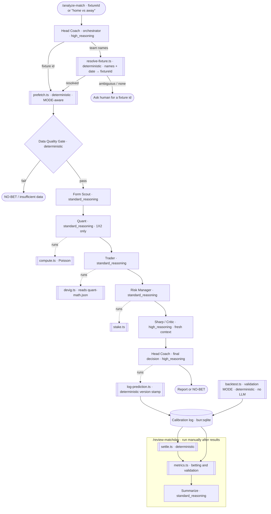

# AGENTS.md — multi-agent configuration

Tool-agnostic description of the **backroom** agent factory: who the agents are,
what they may decide, what they must _not_, and how they hand off to one another.
This file is deliberately independent of any particular agent runtime — it
describes the contract, not a vendor's harness.

---

## Agent roster

| Agent            | Role                                                        | Model tier           | Why this tier                                                                                                        |
| ---------------- | ----------------------------------------------------------- | -------------------- | -------------------------------------------------------------------------------------------------------------------- |
| **head-coach**   | Orchestrator; owns the final BET / NO-BET decision          | `high_reasoning`     | Integrates every report, weighs dissent, and is accountable for the call — the highest-value judgment in the system. |
| **form-scout**   | Qualitative read of recent form / momentum                  | `standard_reasoning` | Bounded interpretation of a small structured slice; no novel reasoning needed.                                       |
| **quant**        | Sanity-checks the deterministic Poisson estimate            | `standard_reasoning` | The math is done by a script; the agent only interprets and cross-checks it.                                         |
| **trader**       | Interprets de-vig + value vs our estimate                   | `standard_reasoning` | The de-vig/value math is deterministic; the agent judges whether the edge is real.                                   |
| **risk-manager** | Bankroll discipline + responsible-gambling gate             | `standard_reasoning` | Applies fixed rules with judgment; the sizing math is deterministic.                                                 |
| **sharp**        | Red-team critic in **fresh context**; tries to kill the bet | `high_reasoning`     | Adversarial reasoning against a confident conclusion is where a strong model earns its keep.                         |

### The two Opus seats

Model tiers map to concrete names in `src/lib/config.ts` (`MODEL_TIERS`), referenced
**by role**, never hard-coded in agents. There is **no Haiku** anywhere; Sonnet is
the floor. The two `high_reasoning` (Opus) seats are deliberately the two
highest-leverage judgments:

1. **head-coach** — the final decision.
2. **sharp** — the adversary that must be good enough to genuinely challenge it.

The authoritative mapping lives in `AGENT_MODELS` in `config.ts`:

```
head-coach   → high_reasoning      form-scout → standard_reasoning
sharp        → high_reasoning      quant      → standard_reasoning
                                   trader     → standard_reasoning
                                   risk-manager → standard_reasoning
```

---

## Determinism boundary — scripts compute, agents judge

This is the single most important rule of the factory.

- **All math and all data acquisition live in deterministic Bun code** — never in
  an agent. The Poisson model, de-vig, value, EV, stake sizing, league averages,
  medians, Brier scores: all hand-written, unit-tested, in `src/lib/` and
  `src/scripts/`.
- An agent **never** computes a number. The deterministic script writes a
  `*-math.json`; the agent **reads** it, adds qualitative judgment, and writes its
  own report. (Quant ↔ `compute.ts`/`quant-math.json`; Trader ↔
  `devig.ts`/`trader-math.json`; Risk Manager ↔ `stake.ts`/`risk-math.json`.)
- **Numbers never round-trip through an agent.** Downstream scripts read computed
  values from the deterministic `*-math.json`, not from agent reports (e.g.
  `devig.ts` reads `quant-math.json`, not `quant.json`). The version stamp is built
  deterministically by `log-prediction.ts` (`buildVersionStamp`), not transcribed
  by the Head Coach.
- **Prefetch happens before any LLM runs.** No agent touches the network. The only
  networked code is `api-client.ts`, invoked by
  `resolve-fixture.ts`/`prefetch.ts`/`settle.ts`/`backtest.ts`.
- Every agent output is gated by the deterministic **backpressure validator**
  (`validators.ts`, via `validate.ts`) before it is accepted: schema → bounds →
  consistency → **cross-check** (the numbers an agent copied must EQUAL the
  deterministic `*-math.json` source, not merely be in-bounds — a within-bounds
  altered probability fails here). Invalid → sent back to the agent (bounded retry).

---

## The JSON-contract approach

Agents communicate **only** via the structured shapes in
[`src/lib/contracts.ts`](src/lib/contracts.ts) — never free-form text. That file is
authoritative; this document does not restate the field lists. Key contracts:

- `PrefetchBundle` — the deterministic input package (fixture, coverage, form,
  baseline, odds, optional API predictions, timestamps, `missing[]`).
- `DataQualityResult` — the gate verdict (`pass`/`fail` + `inputConfidence`).
- `FormScoutReport`, `QuantReport`, `TraderReport`, `RiskReport`, `SharpReport` —
  one per worker agent.
- `FinalDecision` — the Head Coach's human-facing output; **`NO-BET` is
  first-class**. Carries a `PipelineVersion` stamp and the Sharp's dissent.
- `PredictionRecord` — one row in the calibration log.

Run artifacts are written into a per-match run directory by the conventions in
[`src/lib/run-paths.ts`](src/lib/run-paths.ts): `runs/<fixtureId>/{prefetch, gate,
form-scout, quant-math, quant, trader-math, trader, risk-math, risk, sharp,
decision}.json`.

---

## Per-agent endpoint / data-slice mapping

Each agent is handed **only its focused slice** of the `PrefetchBundle`, plus (for
the math-backed agents) its deterministic `*-math.json`. Data comes from
API-Football v3 endpoints via `api-client.ts`.

| Agent             | Reads                                                                  | Backing data / API-Football endpoint                                                                                                                                                                                     |
| ----------------- | ---------------------------------------------------------------------- | ------------------------------------------------------------------------------------------------------------------------------------------------------------------------------------------------------------------------ |
| (resolve)         | the slash-command argument (team names + optional date)                | `/fixtures?date=` → pure name match (`fixture-match.ts`) → a fixture id. Deterministic, no LLM; **skipped** when the argument is already a numeric id.                                                                   |
| (prefetch)        | —                                                                      | **live**: `/fixtures`, `/leagues` (coverage), `/teams/statistics`, `/standings`, `/odds` (fresh), `/predictions`. **validation**: `/fixtures` (season) → as-of baseline/form (no lookahead), `/odds` (cached historical) |
| Data Quality Gate | `prefetch.json`                                                        | deterministic — odds present, baseline present, both form windows ≥ `MIN_FIXTURES` (5)                                                                                                                                   |
| **form-scout**    | `bundle.form` (short window, last ~10)                                 | live `/fixtures?team&last`; validation `getRecentFormBySeason(beforeDate)` → `FormWindow`                                                                                                                                |
| **quant**         | `bundle.baseline` + `quant-math.json`                                  | live `/teams/statistics` + `/standings`; validation as-of `computeBaselineFromFixtures` → Poisson `computeOneXTwo`                                                                                                       |
| **trader**        | `bundle.odds.consensus` + `quant-math.json` probs → `trader-math.json` | `/odds` (consensus median across books, Match Winner / bet id 1) → shared `computeValue` (de-vig + value)                                                                                                                |
| **risk-manager**  | `trader-math.json` → `risk-math.json`                                  | deterministic `fixedPctStake` / `expectedValue` over `BANKROLL`/`STAKE_PCT`/`MAX_STAKE`                                                                                                                                  |
| **sharp**         | raw data + the proposed conclusion (NOT the Quant's reasoning)         | sees the inputs in fresh context to attack independently                                                                                                                                                                 |
| **head-coach**    | all reports                                                            | integrates everything → `FinalDecision` → `log-prediction.ts` stamps the version deterministically → calibration log                                                                                                     |

> Two data windows are kept strictly separate: the **short form window**
> (`FormWindow`, momentum, Form Scout only) and the **season-long baseline**
> (`BaselineRates`, strengths, Quant only). Never conflate them.

---

## The thin chain



---

## LIVING-DIAGRAM RULE

**Whenever the agent roster, the flow, or the model assignments change, the mermaid
diagram above MUST be updated in the same change.**

A stale diagram is worse than no diagram — it actively misleads. Treat the diagram,
this roster table, the per-agent mapping, and `AGENT_MODELS`/`AGENT_PROMPT_VERSIONS`
in `src/lib/config.ts` as **a single coupled unit**. If you add a scout, swap a model
tier, or reorder the chain, the table _and_ the diagram change before the work is
"done". Keeping them in sync is part of done, not a follow-up.
