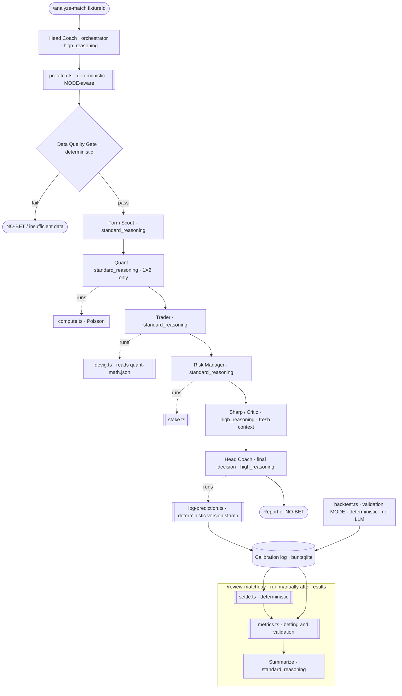

# backroom — a Football Match Analysis Factory

A multi-agent system that **challenges the bookmaker's 1X2 (match-result) odds**. It
forms its own independent, calibrated probability estimate for a single fixture,
strips the bookmaker's margin out of the market price, and only flags a bet when
**our** number is enough above the **vig-free fair** number to clear a value
threshold. The most common — and most valuable — output is **NO-BET**.

---

## Honest framing (read this first)

This tool finds the occasional mispricing and, more importantly, **enforces
discipline**. It is **not** a guaranteed profit engine, and it does not pretend to
be one.

- The bookmaker's odds are a **professional consensus plus a margin** (the
  "overround" / "vig"). That consensus is sharp. Beating it *systematically* is
  extremely hard — most published "value" is noise once the margin and your own
  estimation error are accounted for.
- The whole point of the architecture is to be **willing to say NO-BET**, loudly
  and often. A system that always finds a bet is broken.
- The honest expectation for flat-stake P/L is **near break-even, often slightly
  below**. The calibration log exists precisely to confront you with that truth
  rather than hide it. If your "70% calls" do not land ~70% of the time, the
  numbers will say so.

### Responsible gambling

Only ever stake money you can afford to lose. The Risk Manager enforces a fixed
fraction of bankroll (`STAKE_PCT`) and a hard per-bet cap (`MAX_STAKE`), and can
reject a bet outright — those guardrails are there for a reason; do not remove
them. Betting can be addictive. If it stops being a disciplined experiment and
starts being a compulsion, stop, and seek help (e.g. your national problem-gambling
helpline). This software is for analysis and education, with no warranty.

---

## What it is / MVP scope

**MVP market: 1X2 (home / draw / away) ONLY.**

The MVP runs a deliberately **thin chain** of agents, each handed only its focused
slice of deterministically-prefetched data:

```
Head Coach → Form Scout → Quant → Trader → Risk Manager → Sharp → Head Coach (final decision)
```

- **Head Coach** — orchestrator; owns the final BET / NO-BET decision (Opus seat).
- **Form Scout** — qualitative read of recent form / momentum (short window).
- **Quant** — runs the deterministic Poisson model, sanity-checks the output.
- **Trader** — de-vigs the market, locates per-outcome edge vs our estimate.
- **Risk Manager** — bankroll discipline + responsible-gambling gate.
- **Sharp** — red-team critic in fresh context; tries to kill the bet (Opus seat).

### Named extension points (deliberately NOT built)

These are real seams in the code, left unimplemented on purpose so the calibration
log can *justify* building them later:

- **Scouts:** Lineup Scout, Player Scout, Context Scout, and a **Head Scout** to
  fuse parallel scout reports.
- **Markets:** Over/Under, BTTS, parlays.
- **Math:** Dixon-Coles low-score correction (the draw fix), and **power** / **shin**
  de-vig methods (`devig()` throws for these today).
- **MCP** tool integration.

> The **multiclass Brier** over the full 1X2 triple is now BUILT (it scores the
> validation-mode backtest in `calibration-metrics.ts`); the live betting log still
> scores only the binary selection event.

---

## The thin chain



> **Living-diagram rule:** this diagram is part of "done". If the roster, the flow,
> or the model assignments change, the diagram changes in the *same* commit. A stale
> diagram is worse than none.

---

## Architecture summary

**Orchestrator-worker.** The Head Coach orchestrates; each worker agent does one
job over one data slice and returns one structured report. Integration and
verification only work reliably when every hand-off is structured data, never
free-form prose.

**Deterministic prefetch before any LLM.** `src/scripts/prefetch.ts` pulls
everything the agents could need from API-Football into a single `PrefetchBundle`
*before any model runs*. No agent ever touches the network.

**Determinism boundary — scripts compute, agents judge.** All math and all data
live in plain Bun scripts/libs; the LLM is used only for judgment. The Poisson
model (`compute.ts` → `odds-math.ts`), the de-vig + value math (`devig.ts` →
`computeValue`), and the stake sizing (`stake.ts`) each write a `*-math.json` file.
The corresponding agent *reads* that file, adds qualitative interpretation, and
writes its report — it performs **no arithmetic itself**. Crucially, a computed
number **never round-trips through an agent**: downstream scripts read it from the
deterministic `*-math.json` (e.g. `devig.ts` reads `quant-math.json`, not
`quant.json`), and the version stamp is built by `log-prediction.ts`
(`buildVersionStamp`), not transcribed by the Head Coach.

**Backpressure validators.** Every agent report passes through `validators.ts`
(via `bun run src/scripts/validate.ts <agent> <fixtureId>`) before it is accepted
downstream. **Four layers** — schema, bounds, consistency (e.g. `edge === ourProb −
fairProb`), and a **cross-check** that the numbers the agent copied EQUAL the
deterministic `*-math.json` source (not merely in-bounds, so a within-bounds
altered probability still fails). It reports *all* errors at once so a single retry
can fix everything. An invalid report is sent back to the agent (bounded retry); it
does not silently corrupt the run.

**The Data Quality Gate.** `data-quality-gate.ts` runs immediately after prefetch.
It checks odds presence, season baseline availability, and that **both** form
windows have at least `MIN_FIXTURES` (5) resolved matches. A `fail` short-circuits
to NO-BET; a `pass` still carries an `inputConfidence` (high / medium / low) so
downstream agents temper their certainty.

**Two separate data windows.** These are never conflated:

- **Short form window** (`FormWindow`, last ~10 resolved matches) — momentum, for
  the Form Scout only.
- **Season-long baseline** (`BaselineRates`) — attack/defense strengths normalized
  against league averages, for the Quant's Poisson model only.

**MODE — `live` vs `validation` (no-lookahead).** `prefetch.ts` branches on `MODE`.
In `live` it reads season-to-date aggregates (`/teams/statistics`, `/standings`,
last-N form) — correct for an *upcoming* fixture. In `validation` (for a COMPLETED
season) it reconstructs the baseline and form **as of kickoff**, from only the
matches that kicked off *before* the fixture (`computeBaselineFromFixtures` /
`getRecentFormBySeason(beforeDate)`), so a season aggregate that already contains
the match being predicted can never leak the future into the estimate. The
`backtest.ts` runner uses this to score a whole season deterministically (no LLM)
into the calibration log: multiclass Brier vs a base-rate baseline, reliability,
accuracy, and a flat-stake value P/L (a *ceiling* — it omits the live Sharp/Risk
vetoes).

**Graceful degradation + bounded retry.** Prefetch respects per-league coverage
flags (never calls an endpoint the provider says is unavailable), records anything
missing in `missing[]`, and always exits 0 — the verdict lives in `gate.json`, not
the exit code. The API client (`api-client.ts`) retries 5xx/network errors up to
twice with backoff and caches stable data; live odds are always fetched fresh.

---

## The math, briefly

- **Independent-Poisson 1X2** (`computeOneXTwo`): team per-match goal rates are
  normalized into attack/defense strengths against league averages → two Poisson
  λ → a joint scoreline matrix → collapsed into home/draw/away. λ is clamped to a
  sane range.
- **No hand-tuned draw factor.** Pure independent Poisson systematically
  under-predicts low-scoring draws (real matches are mildly negatively correlated
  near 0-0 / 1-1). This is left **uncorrected on purpose** — the calibration log
  surfaces the draw mis-calibration, and *that evidence* is what justifies building
  the Dixon-Coles upgrade.
- **De-vig** (`devig`): MVP uses **proportional** (normalized) de-vigging — simple
  and *known-biased* (it spreads the margin evenly and ignores favorite-longshot
  bias). `power` and `shin` are extension points that throw today.
- **Value & staking:** `expectedValue = prob · odds − 1`; `fixedPctStake` =
  bankroll × `STAKE_PCT`, floored at 0 and capped at `MAX_STAKE`.

---

## Setup

Requires **Bun 1.3**. **Zero external dependencies** — only Bun built-ins
(`fetch`, `bun:sqlite`, the `bun test` runner, native `.env` loading).

```bash
bun install                  # dev types only; no runtime deps
cp .env.example .env         # then edit .env
```

Set the following in `.env`:

| Variable | What it is |
| --- | --- |
| `API_FOOTBALL_KEY` | Your key from [api-football.com](https://www.api-football.com/) (free tier ≈ 100 requests/day). **Required.** |
| `API_FOOTBALL_BASE_URL` | Defaults to `https://v3.football.api-sports.io`. |
| `BANKROLL` | Total bankroll (default `1000`). |
| `STAKE_PCT` | Fixed fraction of bankroll per bet (default `0.02` = 2%). |
| `MAX_STAKE` | Hard per-bet cap (default `50`). |
| `VALUE_THRESHOLD` | Minimum edge (our prob − fair prob) to call something value (default `0.05`). |
| `DEVIG_METHOD` | `proportional` (MVP default) \| `power` \| `shin` (extensions). |
| `MODE` | `validation` (default — no-lookahead historical backtest) \| `live` (upcoming fixtures, fresh odds). |
| `LEAGUE_ID` / `SEASON` | Competition + completed season to read (default `39` / `2023` = EPL 2023/24). Run `capability.ts` to confirm your plan unlocks them. |

**Rate limit:** stable data (coverage, fixtures, season stats, standings,
predictions) is cached in `data/cache.sqlite` with a 24h TTL, so repeated runs on
the same fixture stay well under the free tier. Only live odds are fetched fresh
each time.

---

## Usage

### Orchestrated (the normal path)

- `/analyze-match <fixtureId>` — runs the full thin chain for one fixture: prefetch
  → gate → Form Scout → Quant → Trader → Risk Manager → Sharp → Head Coach final
  decision, then logs the (versioned) prediction. Emits a report or a NO-BET.
- `/review-matchday` — run **manually after results are in**: settle open
  predictions against real outcomes, recompute calibration metrics, and summarize.

### Raw Bun scripts (what the orchestration calls under the hood)

```bash
bun test                                       # run the unit-test suite
tsc --noEmit                                   # typecheck

bun run src/scripts/capability.ts              # confirm your plan unlocks the MODE's endpoints
bun run src/scripts/prefetch.ts <fixtureId>    # → runs/<id>/prefetch.json + gate.json (MODE-aware)
bun run src/scripts/compute.ts  <fixtureId>    # → runs/<id>/quant-math.json (Poisson)
bun run src/scripts/devig.ts    <fixtureId>    # → runs/<id>/trader-math.json (reads quant-math.json)
bun run src/scripts/stake.ts    <fixtureId>    # → runs/<id>/risk-math.json
bun run src/scripts/validate.ts <agent> <id>   # VALID/INVALID gate (schema/bounds/consistency + math cross-check)

bun run src/scripts/log-prediction.ts <id>     # decision.json → calibration log (deterministic version stamp)
bun run src/scripts/settle.ts                  # resolve open predictions (needs API key)
bun run src/scripts/metrics.ts                 # → data/metrics.json (betting + validation) + readable report

bun run src/scripts/backtest.ts [league] [season] [limit]  # lookahead-safe validation backtest → calibration log
```

The `*-math.json` files are written by the deterministic scripts; the agent then
reads its math file, adds judgment, and writes `<agent>.json` into the same run dir.

---

## The calibration / self-improving loop

Every prediction is **versioned and logged**. Each `FinalDecision` carries a
`PipelineVersion` stamp — pipeline version, per-agent prompt versions, model
assignments, math version, data provider, de-vig method, value threshold, and data
timestamps — so any change in calibration can be attributed to a specific cause
(prompt edit, model swap, threshold change).

After matches resolve, `settle.ts` records the real outcome and the per-prediction
Brier contribution; `metrics.ts` reports:

- **Mean Brier** — accuracy of the probabilities (lower is better).
- **Reliability curve** — predicted vs observed frequency per probability bucket:
  do the 70% calls really land ~70% of the time?
- **Hit rate** and **flat-stake P/L / ROI** — the honest bottom line.

Expect a result **near or slightly below break-even**, and treat that as the truth.
The loop's value is not a magic edge; it is that it *measures* whether you have one
and refuses to let you fool yourself.

---

## File map

```
backroom/
├─ README.md  AGENTS.md  CLAUDE.md      # docs (this file + agent config + project rules)
├─ .env.example  package.json  tsconfig.json  .gitignore
├─ src/
│  ├─ lib/                              # deterministic core + contracts (the spine)
│  │  ├─ contracts.ts                   # all JSON contract types (authoritative)
│  │  ├─ config.ts                      # tunables, model tiers, version stamps, MODE
│  │  ├─ run-paths.ts                   # per-match run dir + sqlite path conventions
│  │  ├─ odds-math.ts (+ .test)         # Poisson, de-vig, computeValue, EV, staking
│  │  ├─ data-quality-gate.ts (+ .test) # the deterministic Data Quality Gate
│  │  ├─ historical-baseline.ts (+ .test) # as-of-date baseline (no-lookahead backtest)
│  │  ├─ validators.ts (+ .test)        # backpressure: schema/bounds/consistency/cross-check
│  │  ├─ api-client.ts (+ .test)        # the ONLY network lib (API-Football v3)
│  │  ├─ cache.ts (+ .test)             # bun:sqlite TTL cache (stable data only)
│  │  ├─ calibration.ts (+ .test)       # bun:sqlite prediction + calibration log
│  │  └─ calibration-metrics.ts (+ .test) # pure Brier / reliability / P/L (binary + multiclass)
│  └─ scripts/                          # thin CLI wrappers around the libs
│     ├─ capability.ts                  # preflight: does the plan unlock the MODE's endpoints?
│     ├─ prefetch.ts                    # MODE-aware network prefetch + gate → run dir
│     ├─ compute.ts                     # Poisson → quant-math.json
│     ├─ devig.ts                       # de-vig + value (reads quant-math.json) → trader-math.json
│     ├─ stake.ts                       # stake sizing + EV → risk-math.json
│     ├─ validate.ts                    # agent-report validation gate (+ math cross-check)
│     ├─ log-prediction.ts             # decision → calibration log (deterministic version stamp)
│     ├─ settle.ts                      # resolve outcomes + Brier
│     ├─ metrics.ts                     # calibration report → data/metrics.json
│     └─ backtest.ts                    # lookahead-safe validation backtest → calibration log
├─ runs/<fixtureId>/                    # per-match artifacts (prefetch/gate/*-math/<agent>/decision)
└─ data/                               # cache.sqlite, calibration.sqlite, metrics.json
```

---

## Definition of success

The deliverable is **not** a profitable tipster. It is a **transparent, testable,
well-calibrated, disciplined factory**: every number is reproducible from a script,
every claim is unit-tested, every prediction is versioned and scored, and the system
says NO-BET whenever the inputs or the edge don't justify a stake.

The reusable **pattern** — deterministic prefetch, a strict determinism boundary,
structured contracts between agents, backpressure validation, an orchestrator with a
red-team critic, and a self-measuring calibration loop — is the real product.
